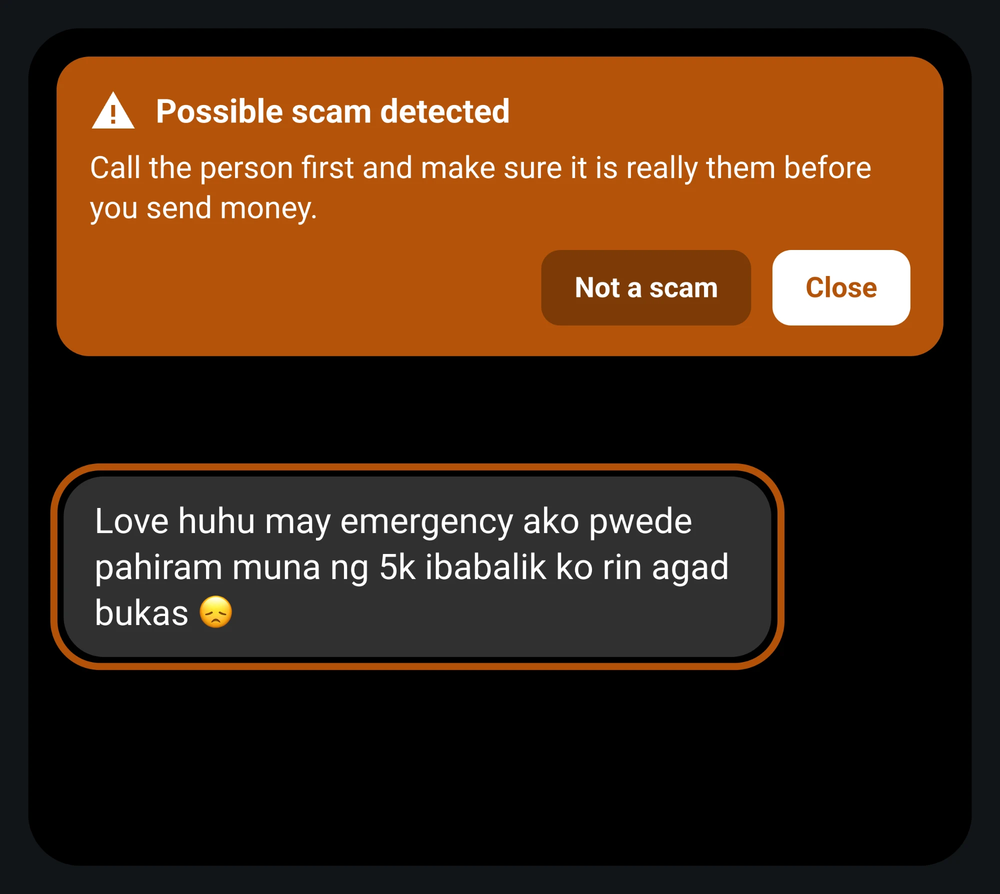
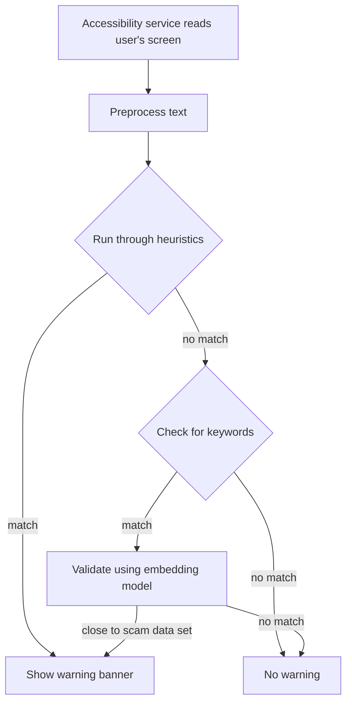

**Scam texts cost Filipinos money every day.** Scam Guardian spots them on your screen and warns you, with AI that never leaves your phone.



[**Watch the demo video**](https://www.linkedin.com/posts/baron-rodrigo_appbuildersph-localai-ugcPost-7514449543350992896-LwGJ/) · [**Download the APK**](https://github.com/Flesky/scam-guardian/releases/latest/download/scam-guardian.apk) for Android 8 or newer. It is large (about 560 MB) because the AI model is inside it: there is nothing else to download.

## Who it is for

People who are not sure which messages to trust: parents and grandparents who get "your points are expiring" texts, and the family members who worry about them. There is no account and nothing to learn. When a message looks like a scam, a warning appears on top of it and says what to do.

It works in Messenger, WhatsApp, Viber, Telegram, Google Messages and Samsung Messages, and in Chrome, Samsung Internet and Firefox.

## How it works



## Why local AI

Scam Guardian reads the text on your screen across your apps. It can be anything: OTPs, balances, passwords, or sensitive data. Sending it to any API would be risky. Not requiring internet at all, Scam Guardian enables an always-on protection you can rest easy with, knowing your data stays local.

## What runs locally

Everything runs locally. Nothing needs internet.

## Measured results

Measured on a Samsung Galaxy S23 Ultra (Snapdragon 8 Gen 2, Android 16, GPU backend) with 90 messages the app had never seen: 45 scams and 45 normal messages in English, Filipino and Taglish. The messages were written with an AI coding tool before the first run and not changed after it. They are not collected from real inboxes.

| | Result |
| --- | --- |
| Scams warned | 34 of 45 (76%) |
| Scams missed | 11 of 45 (24%) |
| False alarms on normal messages | 7 of 45 (16%) |
| Checking one message | about 33 ms with rules only, about 100 ms with the model |
| Model load | 1.4 to 2.3 s, plus about 2.5 s for the anchors |

To reproduce, connect a phone and run:

```bash
./gradlew installDebug assembleDebugAndroidTest
adb install -r app/build/outputs/apk/androidTest/debug/app-debug-androidTest.apk
adb shell am instrument -w -e class ph.scamguardian.benchmark.DetectionBenchmark ph.scamguardian.test/androidx.test.runner.AndroidJUnitRunner
adb pull /sdcard/Android/data/ph.scamguardian/files/benchmark/results.json
```

Messages: `app/src/androidTest/assets/benchmark_messages.json`. Raw output of both runs: `docs/benchmark/`.

## Known limits

- It misses some kinds of scam: prizes that ask for a fee, task and job offers, loan fees, romance and extortion.
- It gives false alarms on some normal messages, such as a friend saying a debt is paid.
- The app uses about 1 GB on the phone. The model is stored twice, in the APK and in app storage, because LiteRT-LM cannot read it from inside the APK.
- The test messages were written for the test. Real inboxes may give different numbers.

## Disclosures

- **Team:** Pure Vibes (Baron Rodrigo, solo)
- **Models:** EmbeddingGemma 2 (`embeddinggemma-2-740m.litertlm`, Google, from Hugging Face `litert-community`), pre-trained and not fine-tuned. Embeddings are cut to 256 dimensions.
- **Technologies and frameworks:** Kotlin, Jetpack Compose and LiteRT-LM. Versions are under Development.
- **APIs and cloud services:** none.
- **Existing code and assets:** none. Everything was made during the hackathon. The mascot sounds and images were generated with Claude Opus 5.5.
- **AI development tools:** OpenAI Codex and Claude Code.
- **Demo video:** [LinkedIn post](https://www.linkedin.com/posts/baron-rodrigo_appbuildersph-localai-ugcPost-7514449543350992896-LwGJ/)

## Development

### Stack

- Kotlin 2.4.21, Jetpack Compose (BOM 2026.09.00)
- Android Gradle Plugin 9.4.1, Gradle 9.8.1, Kotlin DSL, version catalog
- LiteRT-LM 0.18.0
- Detection pipeline: kotlinx-serialization-json 1.11.0, commons-text 1.15.0, ICU4J 78.3, url-detector 0.1.24, Guava 33.7.2-android
- Spotless 8.10.4 with ktlint 1.8.0
- detekt 1.23.8 with Compose rules 0.4.28
- Lefthook 2.2.1
- minSdk 26, targetSdk 36, compileSdk 37
- JDK 17

### Setup

1. Install Android Studio and the SDK it requests.
2. Point `JAVA_HOME` at a JDK 17. Android Studio ships one: `export JAVA_HOME="/Applications/Android Studio.app/Contents/jbr/Contents/Home"`
3. Install Node.js LTS and run `npm install` (installs the git hooks).
4. Connect an arm64 Android phone by USB and run `./gradlew installDebug`.
5. Open Scam Guardian on the phone and follow the prompt to turn on its accessibility service.

The model (`embeddinggemma-2-740m.litertlm`, 485 MB) is packaged inside the app. The first build downloads it once from [Hugging Face](https://huggingface.co/litert-community/embeddinggemma-2-740m-litert-lm) into `models/`, which git ignores. Never push the model to the phone by hand and never commit it. The app itself downloads nothing.

Install over USB: the APK is about 560 MB, and over wireless adb it can take more than 10 minutes. The first launch takes about 9 seconds while the model is copied to app storage.

### Commands

| Task | Command |
| --- | --- |
| Build | `./gradlew assembleDebug` |
| Install | `./gradlew installDebug` |
| Test | `./gradlew testDebugUnitTest` |
| Lint | `./gradlew lintDebug detekt` |
| Format | `./gradlew spotlessApply` |
| Full check | `./gradlew spotlessCheck detekt lintDebug testDebugUnitTest` |

### Project structure

```
app/                                  Android app module (:app)
  src/main/java/ph/scamguardian/      Activity, navigation, theme, UI
  src/main/java/ph/scamguardian/core/ Business logic, no Android imports
  src/test/java/ph/scamguardian/core/ Unit tests and fakes
data/                                 Brand catalog, packaged as an app asset
models/                               The model, downloaded by the build (not in git)
docs/benchmark/                       Raw output of the measured results
config/detekt/                        detekt configuration
gradle/libs.versions.toml             Pinned versions
.agents/skills/                       Android agent skills (universal)
.claude/skills/                       Android agent skills (Claude)
.github/workflows/                    CI
```

### Agent rules

See AGENTS.md.
